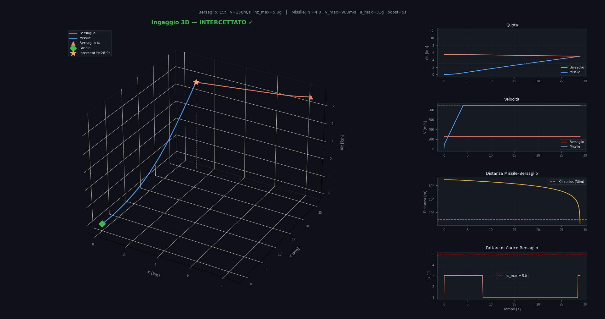
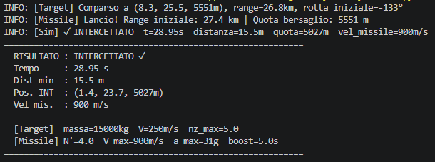

# 3D Missile Intercept Simulator Report

## 1.0 Executive Summary
This project features a custom-built 3D Intercept Simulator written in Python. The core objective of the tool is to evaluate missile guidance algorithms. Rather than relying on simple, pre-programmed paths, the simulation requires the target to perform evasive actions utilizing realistic flight dynamics and unpredictable maneuvers. This environment enables the practical testing and validation of True Proportional Navigation (TPN) against an actively defending target.

---

## 2.0 Target Kinematics and Structural Limits
To ensure physical accuracy, the target aircraft is restricted from executing impossible maneuvers. Although simulated as a point-mass, its turning performance is strictly bound by its maximum structural load factor (nz_max). During a coordinated turn, the highest achievable turn rate (omega_max) is limited by the G-forces the airframe can sustain without breaking. The simulation computes this limitation dynamically with the formula:

    omega_max = min( heading_rate_limit, (nz_max - 1) * g / V )

It is important to note that this equation is a conscious, first-order approximation. It was chosen to keep computational costs low while still providing a highly realistic constraint: as the target flies faster (higher V), its ability to turn sharply decreases. This effectively models a realistic maneuverability envelope.

---

## 3.0 Interceptor Dynamics and TPN Guidance
The missile employs True Proportional Navigation (TPN) to intercept its target. TPN operates by anticipating the target's future position instead of aiming directly at its current location. It achieves this by responding to the rate of rotation of the Line-Of-Sight (LOS) vector:

    a_cmd = N' * Vc * (omega_LOS × r_hat)

In practical terms, N' (the Navigation Ratio) acts as an aggressiveness multiplier. If the target moves and the LOS shifts by 1 degree, a missile with N'=4 will command a turn 4 times as sharp to "pull lead" and establish a collision course. If N' is too low, the missile just chases the target's tail. If N' is too high, it overreacts to every minor movement and wastes its kinetic energy. 

Additionally, during the unpowered coast phase, the code adds a continuous [0, 0, +g] upward acceleration command. This gravitational compensation prevents the missile from dropping under its own weight, which would otherwise cause a false rotation in the LOS calculation and waste steering energy.

---

## 4.0 Random Evasion and Integration
To rigorously evaluate the guidance logic, target maneuvers are initiated via a Poisson process. Practically, this ensures evasions occur at random, unforeseen moments instead of following a predictable schedule. While an average interval is set (such as 20 seconds), the exact time between movements varies continuously, closely mimicking a human pilot making sudden, erratic choices under stress.

Every time a maneuver is triggered, the target selects a new heading and climb rate. The simulation then updates the positions of both the target and the missile 20 times per second (dt = 0.05s) using Euler integration, calculating the engagement geometry step-by-step until intercept or miss.

---

## 5.0 Workflow and AI Assistance
The fundamental flight mechanics, TPN vector calculations, and numerical integration were all derived and coded by hand. To accelerate the development process, an AI assistant was utilized inside the IDE, specifically to generate boilerplate code for data visualization. This included structuring the Matplotlib 3D plots and organizing time-series data for the telemetry dashboard, allowing the core engineering effort to stay focused on physics and mathematics.

---

## 6.0 Current Limitations and Next Steps
While this simulation establishes a robust foundation, several areas are planned for future enhancement:

* **Aerodynamic Drag:** The existing coasting phase does not account for deceleration. Integrating Mach-dependent drag (Cd) will enable accurate kinematic range calculations.
* **6-DOF Rigid Body:** Evolving from a 3-DOF point-mass to a full 6 Degrees of Freedom model, allowing for the inclusion of angle of attack, roll dynamics, and control surface delays.
* **Advanced Guidance (APN):** Transitioning to Augmented Proportional Navigation (APN). By estimating the target's acceleration (typically via a Kalman filter), APN can counter highly agile threats far more effectively than basic TPN.

---

## 7.0 Requirements

To run this simulation, you need Python installed along with the following libraries:

*   **NumPy:** Used for numerical operations and vector calculations.
*   **Matplotlib:** Used for data visualization and generating 3D plots.

You can install these dependencies via pip with the following command:
```bash
pip install numpy matplotlib
```

## Visuals



